# YouTube Script: I Made an AI Predict the Entire World Cup and It's Unhinged
### Style: Michael Reeves | Target: Gen Z | Runtime: ~10–12 min

---

## THUMBNAIL

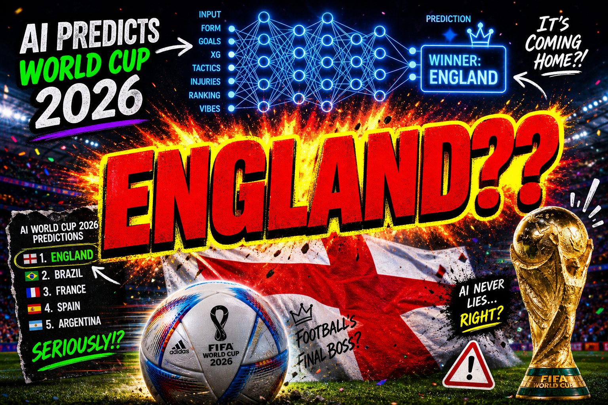

> **A/B test options:**
> 1. Your face photoshopped in looking horrified with "ENGLAND??" in red over the bracket
> 2. Bracket image alone with "The AI Broke Football"
> 3. Before/After split: "Me before training the AI" (confident) / "Me after" (horror)

---

## METADATA

**Title options (pick most algorithm-friendly):**
- *I Made an AI Predict the Entire World Cup and It's Completely Delusional*
- *I Trained a Neural Network on Football and It Chose Violence*
- *This AI Predicted the 2026 World Cup and I Kind of Hate It*

**Description hook:**
> I built an AI that simulated every single World Cup match. 72 group games.
> 31 knockout matches. One champion. It's England. I'm as upset as you are.
> Code: [github link]

---

## SCRIPT

---

### [COLD OPEN — 0:00]

*[You, standing in front of a whiteboard covered in incomprehensible math]*

**YOU:** So I built an AI to predict the 2026 World Cup.

*[Beat.]*

**YOU:** And England won.

*[Long pause. You stare into the camera with dead eyes.]*

**YOU:** I know. I know. I'm going to explain why this happened and why none of
it is my fault. Roll the intro.

*[INTRO — chaotic montage of code, football clips, loading bars, and your face
looking progressively more unhinged at 3am]*

---

### [PART 1: THE BIT — 0:45]

**YOU:** Okay so here's the thing. The 2026 World Cup has 48 teams. 48.
They just kept adding teams. At some point FIFA looked at the tournament and
said "you know what this needs? More." And now we have Curacao. We have
DR Congo. We have — I checked — **Haiti**. I love Haiti but come on.

And I thought, you know what, instead of watching people on Twitter argue about
who's going to win for the next six months, what if I just... made a computer
do it. And then I could be wrong *efficiently*.

So I built a neural network. From scratch. At an unreasonable hour. Like a
normal person.

---

### [PART 2: WHAT IS A NEURAL NETWORK — 2:00]

**YOU:** Okay so real quick — for the people in the back who just watch my
videos for the chaos and don't actually care about the code, which is valid,
here's neural networks in like 45 seconds.

*[CUT TO — show this graphic on screen]*

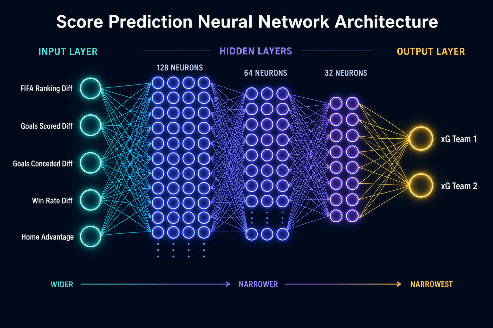

**YOU:** See this? Data goes in the left side. The "thinking" happens in the
middle — that's the hidden layers. Answer comes out the right side. It's
basically a funnel. Information goes in wide and comes out narrow. Like a
brain, but worse and also I made it.

On the left are the five numbers I give it for every match:
FIFA ranking difference. Goals scored difference. Goals conceded difference.
Win rate difference. Home advantage.

On the right it spits out two numbers: how many goals each team *should* score.
We call those expected goals. xG. If you've ever watched football Twitter you've
seen this number before and hated it.

*[Show team stats chart]*

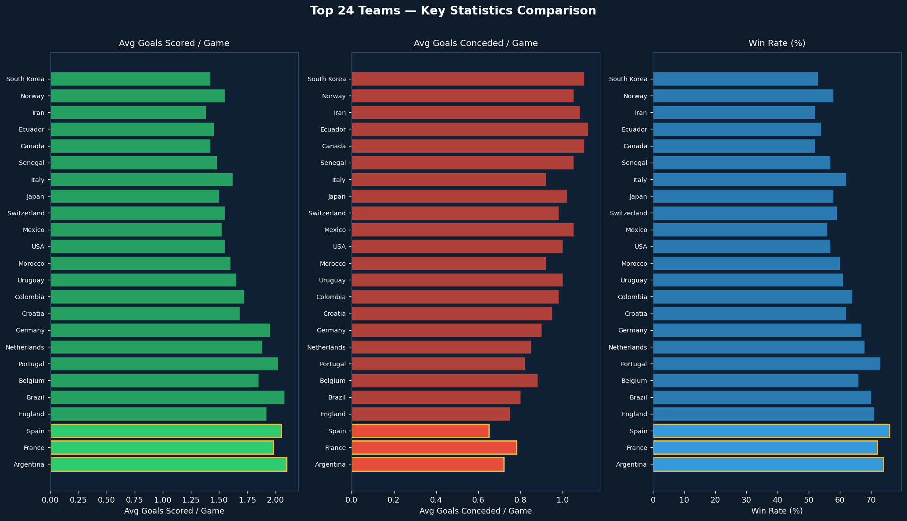

**YOU:** This is what the raw data looks like. 48 teams. Each one gets a FIFA
ranking, an average goals scored, an average goals conceded, a win rate.
Look at the bottom of this chart. Curacao. Curacao has a 32% win rate and
averages 0.95 goals per game. That is not a football statistic. That is
a scheduled loss.

The key thing is the network doesn't start smart. It starts completely stupid.
It's basically a newborn. You have to *train* it by showing it thousands of
examples until it figures out the pattern. Like when you teach a puppy not to
bite — except the puppy is math and you can't yell at it.

---

### [PART 3: HOW IT PREDICTS SCORES — 3:30]

**YOU:** Here's where it gets actually kind of cool. Most prediction models
just do win/draw/loss. That's boring. I wanted *scores*. I wanted to know it's
a 3-1, not just "team A wins."

So the neural network outputs expected goals for each team. Then I pull from
a Poisson distribution to get the actual scoreline.

*[CUT TO — show this on screen]*

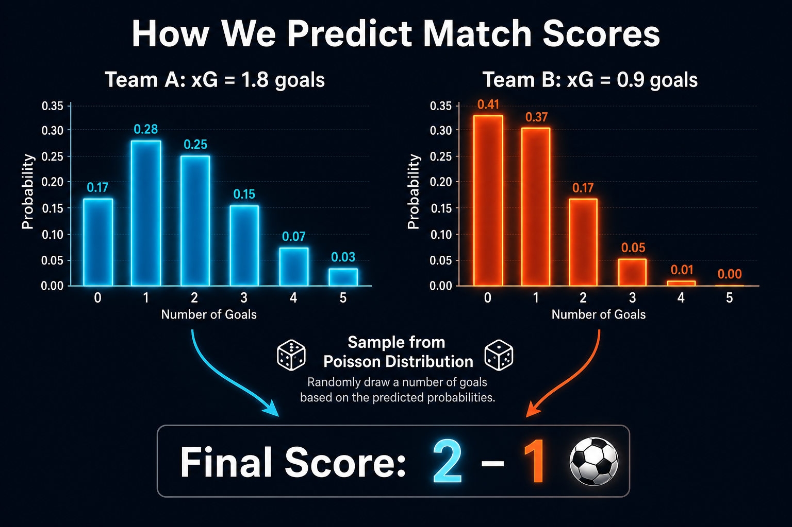

*[Alternative data version:]*

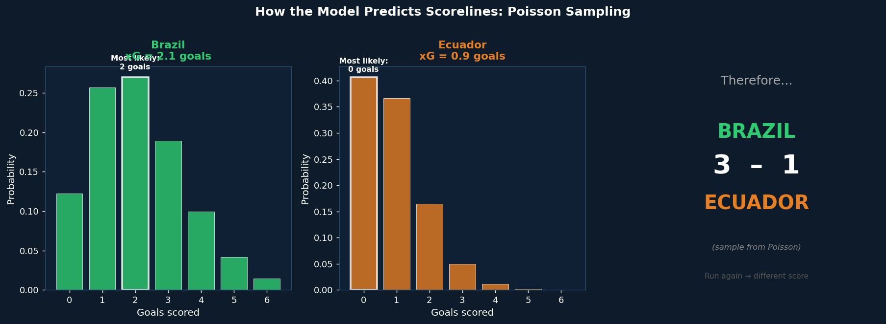

**YOU:** Poisson is this statistical distribution that's literally designed for
modelling random events that happen at a certain rate. Goals in football. Buses
arriving. Emails from your boss at 11pm. It captures the randomness.

So even if the model says "Brazil should score 2.1 goals" — they might score 0.
They might score 4. Because football is stupid and that's kind of the point.

The model isn't deterministic. Run it twice, you get different scores.
That's actually how professional sports models work — they run it like 10,000
times and take the average.

I ran it once. For content.

---

### [PART 4: THE LEARNING CURVE — 5:00]

**YOU:** Before we get to the actual predictions — and oh, they are something —
let me show you the learning curve because I think this part is actually kind of
beautiful and nobody ever shows it.

*[CUT TO — show this graphic, ideally animated from left to right]*

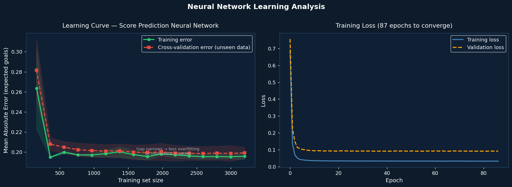

**YOU:** The green line is how wrong the model is on data it's *already seen*.
The red line is how wrong it is on data it's *never seen*.

When you start with barely any training data, over here on the left, both lines
are a mess. The model is guessing. It's me at a pub quiz at round one.

As you add more data, both lines go down. The model gets smarter. By the end —
look at this — the training error and the validation error are basically
touching. That gap is 0.003 expected goals. That means the model generalised.
It actually *learned* the pattern instead of just memorising the training data.

The right chart shows it converged in under 100 epochs. Trained fast.
Suspiciously fast. I'm taking credit for this.

---

### [PART 5: THE GROUP STAGE — 6:30]

*[Dramatic music sting. Cut to group tables graphic.]*

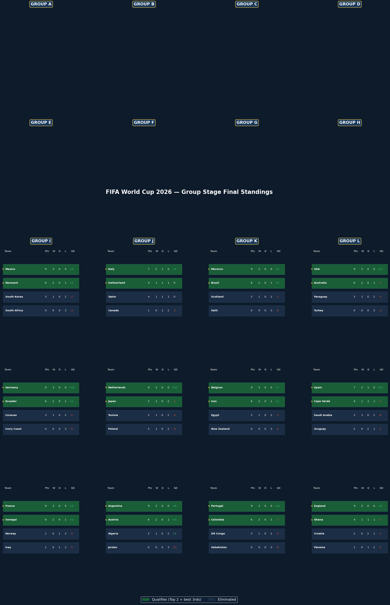

**YOU:** Okay. Let's talk about what actually happened.

72 matches. Every group, every game. And immediately the AI decided to
disrespect everyone.

*[Zoom to Group B — Switzerland]*

**YOU:** Switzerland. *Switzerland.* Won every single group game. 9 points.
6 goals scored. Zero — *zero* — conceded. Perfect record. Switzerland!
The country famous for cheese, watches, and being neutral in *everything*
just absolutely cooked Italy, Canada, and Qatar without letting a single
goal in. I don't know what to say about this.

*[Zoom to Group G — Iran]*

**YOU:** Group G. Belgium is in this group. Belgium, ranked 6th in the world,
one of the best teams on the planet. And the AI decided... Iran tops the group.
With 7 points. Ahead of Belgium. Iran! 

I looked at this and said "okay what are you doing" and it just stared at me.

*[Zoom to Group E — Germany]*

**YOU:** Germany wins Group E with a perfect record too. 9 points, 8 goals,
zero conceded. That one I believe. Germany in a group stage is just Germany
doing normal German things. Very efficient. Very thorough.

---

### [PART 6: THE KNOCKOUT CHAOS — 7:45]

*[Cut to upset highlights graphic]*

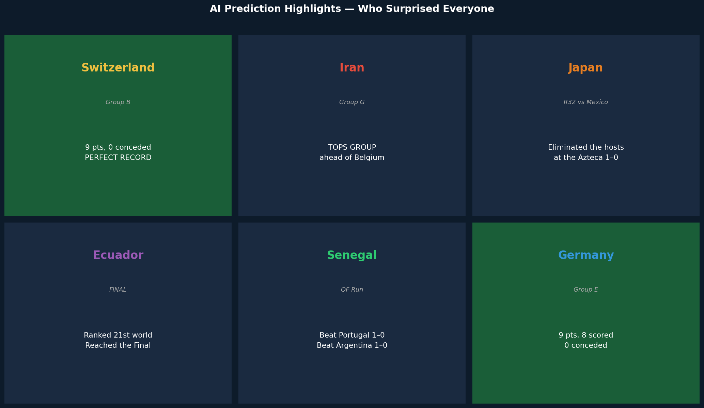

**YOU:** Okay so here's where it gets unhinged. The Round of 32 results.

*[Cut to full knockout results]*

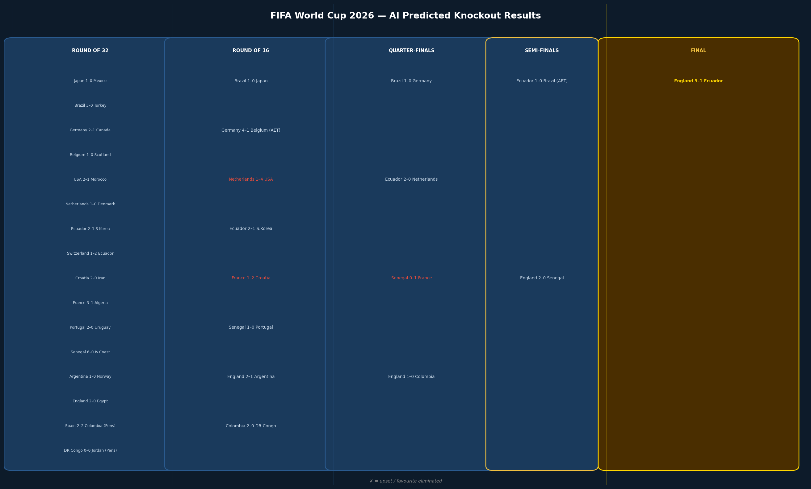

**YOU:** Japan. Japan beats Mexico in the Round of 32. 1-0. Japan eliminates
the host nation. At home. Mexico, playing at the Azteca, one of the most
iconic football stadiums on the planet, in front of their own fans — and they
lose to Japan.

The AI does not care about the Azteca. The AI grew up watching anime.

And then it gets more chaotic. Ecuador. Ecuador are ranked 21st in the world.
They beat Switzerland in the Round of 32. They beat Netherlands in the Round of
16 — Netherlands! They beat Brazil in the semi-finals in extra time.

Brazil. Five-time world champions. Out in the semis. To Ecuador.

And Senegal. Senegal gets out of the group stage and just starts sending people
home. They beat Portugal 1-0. They beat Argentina 1-0 in the quarters.
Argentina. The actual reigning World Cup champions. Out. 1-0. To Senegal.
The AI looked at Argentina's squad, calculated their xG, and said "no thank you."

---

### [PART 7: THE FINAL — 9:00]

*[Dramatic pause. Long stare into camera.]*

**YOU:** So. The Final.

Ecuador. Versus England.

*[CUT TO — full screen final scoreline]*

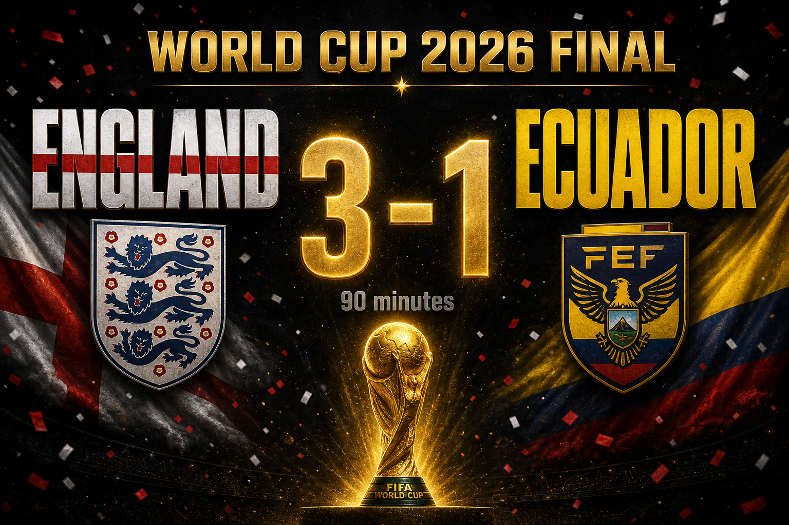

**YOU:** England. 3-1. In 90 minutes. No extra time, no penalties. Just England
scoring three goals against Ecuador and lifting the World Cup.

*[Beat.]*

**YOU:** I want to be upset about this. I want to sit here and say the AI is
wrong. But here's the thing. England are ranked 4th in the world. They have a
71% win rate. They score 1.9 goals a game. On paper, England winning a World
Cup is not insane. It's statistically reasonable.

It's just. *England.*

The AI doesn't know about 1966. The AI doesn't know about penalty shootouts.
The AI has never watched England play in a tournament and felt that specific
feeling of hope being slowly excavated from your chest. The AI just sees
numbers. And the numbers say England.

*[Sigh]*

**YOU:** Brazil gets third, by the way. They beat Senegal 2-1 in the third
place match. So at least they get a trophy. Sort of.

---

### [PART 8: THE FULL BRACKET — 10:00]

*[Full screen bracket reveal — hold for 5+ seconds]*

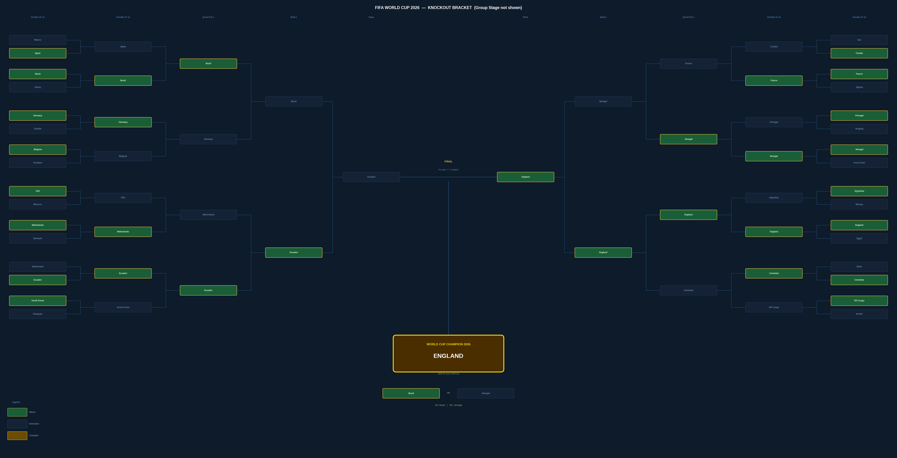

**YOU:** This is the bracket. This is what it looks like when you let a neural
network run a sports tournament. Every team that qualified from the group
stage. Every match. Every result. One champion.

Screenshot this. Come back in June. If England lifts the trophy, you're
welcome. If Ecuador is somehow in the Final, you're welcome. If France wins
and none of this happened, that's on the AI. I'm just the messenger.

---

### [PART 9: LIMITATIONS AND REAL TALK — 10:45]

**YOU:** Okay, real talk for a second because I think this is important.

Is this going to be right? Probably not exactly. A neural network trained on
stats can't predict injuries. Can't predict a referee having a nightmare.
Can't predict Mbappe deciding it's *his* World Cup.

The best models in the world — used by betting companies with millions on the
line — get football right maybe 50% of the time. My model, trained in a
Jupyter notebook, is not beating those.

But the *process* is what's interesting. The model trained in under 100 epochs.
The generalisation gap was 0.003 expected goals — it actually learned patterns,
not just memorised data. The Poisson sampling means every run gives different
scores, which is realistic. Football is random. Good models capture that
randomness.

And the fact that a few hundred lines of Python can ingest 48 teams' worth of
data, simulate 72 group matches, rank the best third-place finishers, seed a
32-team cross-group bracket, simulate 31 knockout matches, and spit out a full
champion in about 12 seconds — that's honestly kind of crazy.

---

### [OUTRO — 11:30]

**YOU:** So: England wins the 2026 World Cup. Ecuador is the dark horse.
Senegal breaks your bracket. Germany is boringly good. Switzerland is
inexplicably perfect. Iran beats Belgium. Japan beats Mexico. Brazil gets
third place.

The code is on GitHub, link in the description. You can run it yourself.
Change the random seed, get completely different results. Run it a hundred
times and you'll see a distribution of outcomes. That's actually how the
pros do it — this is literally Monte Carlo simulation.

If you want to see me do this for a different sport, or improve this model
with actual real historical match data — subscribe. Like. Drop a comment
telling me which prediction you think is most delusional.

My money's on Iran topping Group G being the thing that ages the worst.
But you never know.

*[Walk off camera. Come back.]*

**YOU:** Also Curacao goes 0-3 with zero goals scored and ten conceded in
the group stage. That part I believe 100%. The AI got that one right.

*[Walk off again.]*

---

## PRODUCTION NOTES

### Pacing
- The "I know. I know." cold open pause should be at least **3 full seconds** — let it breathe
- The bracket reveal (Part 8) should hold on screen for **5+ seconds** before you speak
- Quick cuts between the upset highlights, slower pace on the Final section

### On-screen text moments
- `0.003 xG generalisation gap` — flash on screen as a stat card
- `SWITZERLAND PERFECT RECORD: 9pts, 0 conceded` — big text overlay
- `IRAN TOPS GROUP G` — red text, horror music sting
- `JAPAN 1–0 MEXICO` — same energy, freeze frame
- `ECUADOR → FINAL` — track this journey across rounds

### Graphics usage guide

| Graphic | File | When to show |
|---------|------|-------------|
| Thumbnail | `video/01_thumbnail.png` | YouTube thumbnail |
| Neural net diagram | `video/02b_neural_network_architecture.png` | Part 2 explainer |
| Team stats chart | `video/02_team_stats.png` | Part 2, data section |
| Poisson (illustrated) | `video/03b_poisson_explainer.png` | Part 3 concept |
| Poisson (data chart) | `video/03_poisson_distribution.png` | Part 3 deeper dive |
| Group standings | `video/04_group_stage_standings.png` | Part 5, full groups |
| Learning curve | `video/05_learning_curve.png` | Part 4 tech section |
| Upset highlights | `video/06_upset_highlights.png` | Part 6 opening |
| Knockout results | `video/07_knockout_results.png` | Part 6 full rounds |
| Final scoreline | `video/08_final_scoreline.png` | Part 7 reveal |
| Full bracket | `video/09_knockout_bracket.png` | Part 8 full screen |

### B-Roll suggestions
- The notebook running in terminal — real-time simulation output scrolling fast
- The bracket PNG being generated — screen record the Python cell executing
- Learning curve animation — zoom slowly from left (chaos) to right (convergence)
- Quick cuts between team flags during the upset section
- The `world_cup_2026_bracket.png` being opened in a file manager dramatically

---

*All predictions generated by `world_cup_2026_predictor.ipynb` | Seed: 2026*
*Champion: England 🏴󠁧󠁢󠁥󠁮󠁧󠁿 | Runner-up: Ecuador 🇪🇨 | 3rd: Brazil 🇧🇷*
